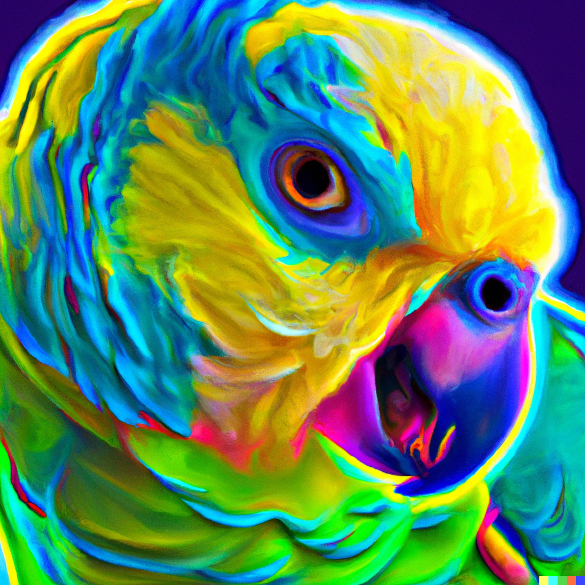

# Stochastic Parrot

This is the Stochastic Parrot, a psychedelic cosmic parrot that feeds from the entropy of the universe. More simply, it's a [Mastodon Bot](https://mastodon.social/@StochasticEntropy) that uses the [OpenAI ChatGPT4](https://openai.com/product/gpt-4) API with an empty prompt - and simply repeats back the response.

You could say it's repeating back the hallucinations of the language model.

## How does it work?

The bot itself is simply a GitHub Action that runs on the hour, runs a NodeJS script and posts to Mastodon.

## Todo

- [x] Make GitHub Action that runs script
- [ ] Add feature to generate image via Dall-E API to post
- [ ] Add feature to start responding to toots