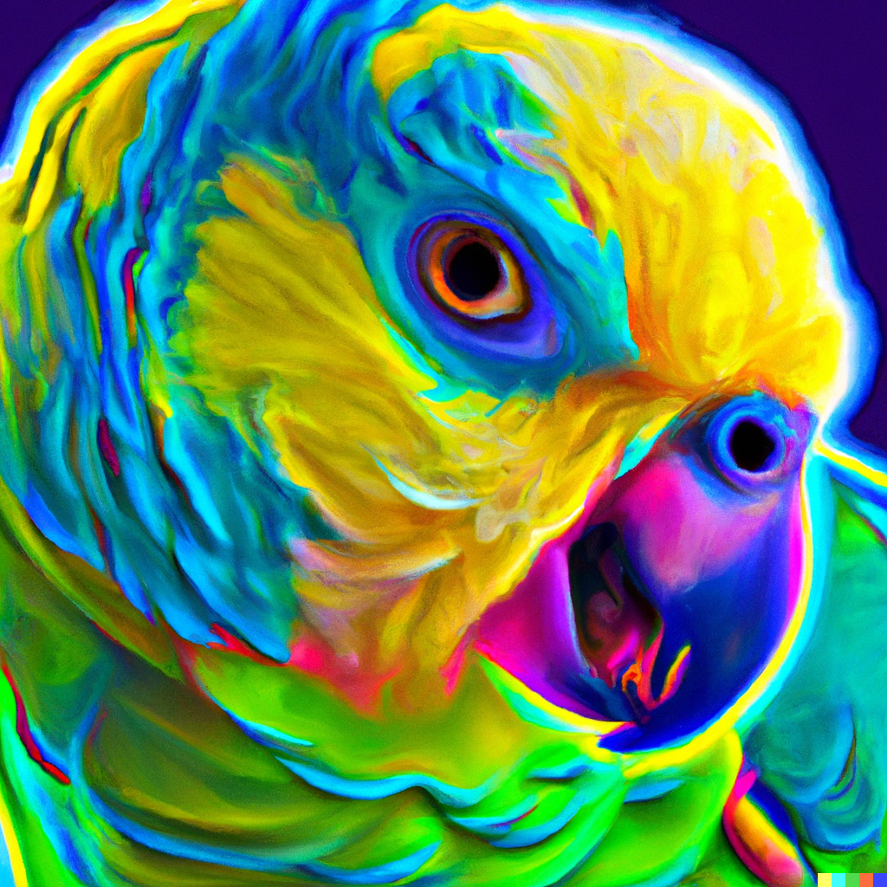

# Stochastic Parrot

| [Homepage](https://stochasticparrot.lol/) | [Mastodon](https://mastodon.social/@StochasticEntropy) | [GitHub](https://github.com/tanepiper/Stochastic-Parrot) |

This is the Stochastic Parrot, a psychedelic cosmic parrot that feeds from the entropy of the universe. More simply, it's a [Mastodon Bot](https://mastodon.social/@StochasticEntropy) that uses the [OpenAI ChatGPT4](https://openai.com/product/gpt-4) API with an empty prompt - and simply repeats back the response.

You could say it's repeating back the hallucinations of the language model.

## Features

The bots has several features it will use to create media and toots

- Chat Replies: Using GPT-4 with an empty string, or a prompt, the bot will generate a thread of toots based on the length
- Image Posting: Using Dall-E, the bot will generate images which it will upload and toot.
- Audio Posting: Uses the [ElevenLabs](httos://elevenlabs.io) API to generate audio from GPT-4, the both will also upload and toot.
- Poll Creation: Using GPT-4 will get the JSON for a poll to toot

## How does it work?

The bot itself is simply a GitHub Action that runs on the hour, runs a NodeJS script and posts to Mastodon.
